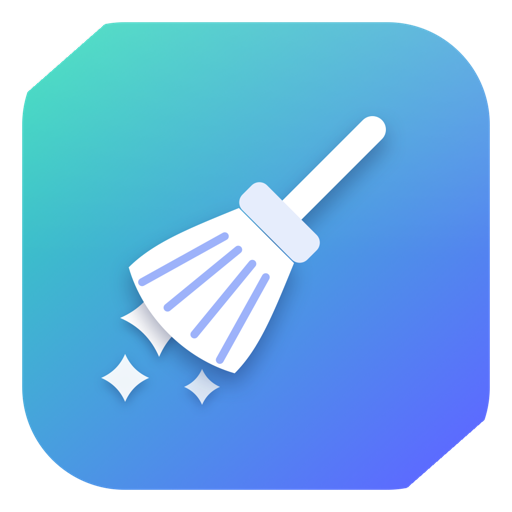
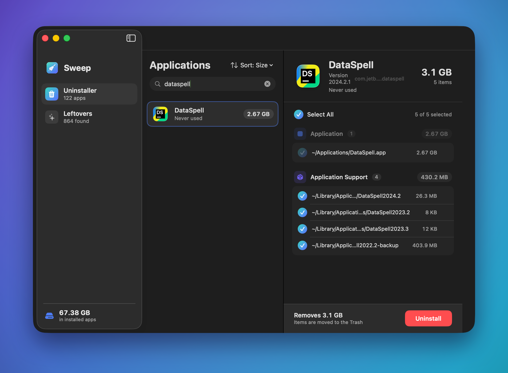

<div align="center">



# Sweep

**A native macOS app uninstaller that removes every trace.**

When you drag an app to the Trash, its caches, preferences, containers and logs
stay behind. Sweep tracks those files down, shows you the whole list with
everything already ticked, and waits for your OK before it deletes a thing. It
also digs up junk left over from apps you got rid of ages ago.

[](https://github.com/Alyetama/Sweep/releases/latest/download/Sweep.dmg)
&nbsp;
[](https://alyetama.github.io/Sweep/)

<br />



</div>

## Features

- Pick an app and Sweep finds everything it scattered: Application Support,
  Caches, Preferences, Containers, Group Containers, Saved State, Logs, Cookies,
  Web Data, login items, and Crash Reports.
- It catches what dragging to the Trash leaves behind, including vendor folders
  with version numbers like `Application Support/JetBrains/DataSpell2024.2`.
  Matching is careful, so uninstalling `Notion` won't drag out `NotionCalendar`.
- The Leftovers tab hunts down orphaned files from apps that are already gone,
  grouped by app so you can expand a group and see exactly what's there.
- Nothing gets deleted outright. Files go to the Trash, so you can put them back
  if you change your mind. Sort by size, name, or last used.
- Plain SwiftUI. No dependencies, nothing phones home.

## Install

1. Download **[Sweep.dmg](https://github.com/Alyetama/Sweep/releases/latest/download/Sweep.dmg)**.
2. Open it and drag **Sweep** into your **Applications** folder.

### Opening it the first time

Sweep is open source and isn't signed with a paid Apple Developer ID, so macOS
Gatekeeper blocks it the first time you open it. You only have to clear that once.

**Option A: Terminal (quickest)**

```sh
/usr/bin/xattr -dr com.apple.quarantine /Applications/Sweep.app
```

Then open Sweep normally from Launchpad or Applications.

**Option B: System Settings**

1. Double-click **Sweep**, then click **Done** on the warning.
2. Open **System Settings > Privacy & Security**.
3. Scroll down and click **Open Anyway** next to "Sweep was blocked", then **Open**.

> Some folders (Mail, Messages, Safari) are locked down by macOS. If you want
> Sweep to reach those too, give it **Full Disk Access** in System Settings >
> Privacy & Security.

## Build from source

```sh
git clone https://github.com/Alyetama/Sweep.git
cd Sweep
./run.sh          # build (release) + launch
```

You'll need the Swift 6 toolchain (Xcode 16 or newer). It's a Swift Package
Manager project that ad-hoc signs itself, so there's no Xcode project to open.

```
Sources/Sweep/
  App.swift            # @main scene
  Models.swift         # InstalledApp, RelatedFile, FileCategory, LeftoverGroup
  Scanner.swift        # app discovery, related-file matching, leftovers scan
  Remover.swift        # move-to-Trash + admin-escalation fallback
  AppModel.swift       # @MainActor view model / background-scan glue
  Theme.swift          # brand colors, category glyphs, formatters
  Views/               # ContentView, Sidebar, Uninstaller, AppDetail, Leftovers
```

## License

[MIT](LICENSE) © Alyetama
